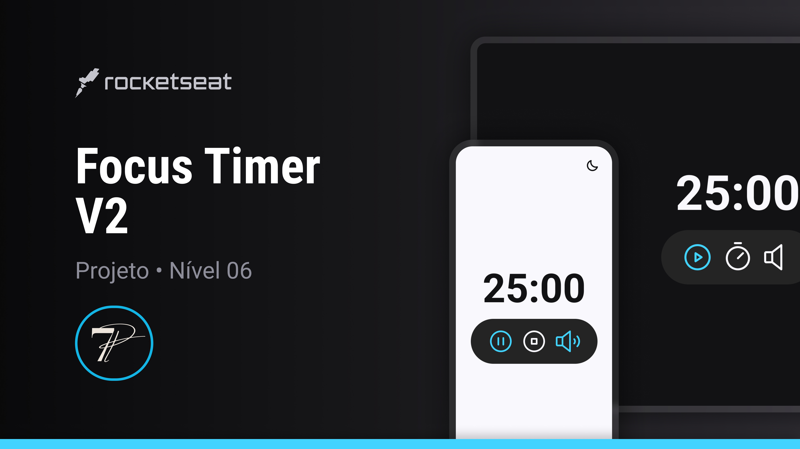

<h1 align="center"> ⏰ Focus Timer  </h1>
 

  ⚠️ <strong>ATENÇÃO</strong> ⚠️
   
  Este é um projeto conceitual e não representa uma empresa ou serviço real.  
  Ele foi criado com o propósito de ser adicionado ao meu portfólio, demonstrando minhas habilidades e capacidades em projetos de design e desenvolvimento.  
  <a href="https://rocketforms.typeform.com/to/fPcSmBp9#referral_id=e8eb53b2-1777-4867-9b33-d468fc9d1422o">Estude projetos como este em formato de vídeo clicando aqui!</a>

 

  <a href="#-projeto" style="color: #FFF; ">Projeto</a>&nbsp;&nbsp;&nbsp;|&nbsp;&nbsp;&nbsp;
  <a href="#-linguagens-tecnologias--ferramentas" style="color: #FFF">Linguagens, Tecnologias & Ferramentas</a>&nbsp;&nbsp;&nbsp;|&nbsp;&nbsp;&nbsp;
  <a href="#-layout" style="color: #FFF;">Layout</a>&nbsp;&nbsp;&nbsp;

 

  

## 🧠 Linguagens, Tecnologias & Ferramentas

Este projeto foi desenvolvido com as seguintes linguagens, tecnologias e ferramentas:

 

## 💻 Projeto

 📊 Um projeto de timer que utiliza ES6 modules, estados, variáveis, callback functions e com modos dark / lite, além de uma música de fundo.

Desenvolvi um timer funcional usando JavaScript moderno com a utilização de módulos ES6, como objetivo em ajudar na otimização organizacional do código, deixando-o de maneira modular e reutilizável.

Utilizando conceitos de estados para controlar o tempo decorrido e a contagem regressiva do timer através das variáveis, para armazenar informações importantes e atualizar dinamicamente o nosso timer.

Além da aplicação de callback functions, permitindo executar ações específicas quando certos eventos ocorrerem, como o término do tempo.

Por fim, implementei uma funcionalidade de dark / light mode, onde o usuário poderá alternar entre os modos escuro e claro para melhorar a experiência visual do timer.

 

# Focus Timer
Um temporizador estilo Pomodoro desenvolvido em JavaScript moderno.

### ⚙️ Funcionalidades

- **Temporizador Pomodoro:** Timer funcional com exibição de minutos e segundos, ideal para técnicas de produtividade como o Pomodoro.
- **Controles de Timer:** 
  - **Iniciar/Pausar:** Botões para iniciar e pausar a contagem do timer.
  - **Ajustar:** Opção para ajustar o tempo do timer.
  - **Reiniciar:** Botão para reiniciar o timer.
- **Modo Dark / Light:** Alternância entre modos escuro e claro com um botão dedicado.
- **Música de Fundo:** Controle para iniciar e parar a música de fundo, melhorando a experiência do usuário durante o uso do timer.
- **Interface Responsiva:** Layout flexível e responsivo, adaptável a diferentes tamanhos de tela.

[➡️😉Acesse o projeto finalizado online](https://pabloperdigao.github.io/Projeto013_FocusTimer/)

## 🔖 Layout

Você pode visualizar o layout do projeto através  
[🔗 DESSE LINK](https://www.figma.com/design/iw6p3lj41VPGkDBd4HkfY2/Focus-Timer-V2-%E2%80%A2-Projeto-Explorer-(Community)?node-id=1422-28&t=uVfCWiz57vrGRoEb-0)

❗ É necessário ter conta no [Figma](https://figma.com?target=_blank) para acessá-lo.

- [Veja outros projetos de UI aqui!](https://www.figma.com/@pabloperdigao)

## 
🎨👨🏼‍💻😎
<strong>Desenvolvido com estilo por Pablo Perdigão!</strong> 
 
[🤝🏼🌐 Siga-me & ajude na criação de uma rede cada vez mais interconectada!](https://pabloperdigao.github.io/DevLinks/)
